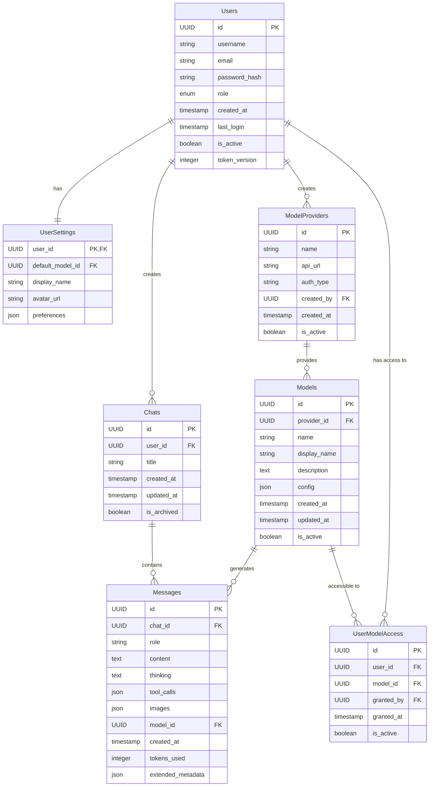

# rovertChat Database Schema

This document outlines the database schema for the rovertChat application, including tables, fields, and their relationships based on the actual SQLAlchemy models implementation.

## Database Tables

### Users

| Column        | Type         | Description                    |
| ------------- | ------------ | ------------------------------ |
| id            | UUID         | Primary key                    |
| username      | VARCHAR(100) | Unique username                |
| email         | VARCHAR(255) | User email address             |
| password_hash | VARCHAR(255) | Hashed password                |
| role          | ENUM         | 'guest', 'user', or 'admin'    |
| created_at    | TIMESTAMP    | Account creation time          |
| last_login    | TIMESTAMP    | Last login time                |
| is_active     | BOOLEAN      | Account status                 |
| token_version | INTEGER      | JWT token version for security |

### ModelProviders

| Column     | Type         | Description                              |
| ---------- | ------------ | ---------------------------------------- |
| id         | UUID         | Primary key                              |
| name       | VARCHAR(100) | Provider name (e.g., 'Ollama', 'OpenAI') |
| api_url    | VARCHAR(255) | Base URL for API requests                |
| auth_type  | VARCHAR(50)  | Authentication method                    |
| created_by | UUID         | Admin who added this provider            |
| created_at | TIMESTAMP    | Creation time                            |
| is_active  | BOOLEAN      | Provider status                          |

### Models

| Column       | Type         | Description                   |
| ------------ | ------------ | ----------------------------- |
| id           | UUID         | Primary key                   |
| provider_id  | UUID         | Foreign key to ModelProviders |
| name         | VARCHAR(100) | Model name                    |
| display_name | VARCHAR(100) | User-friendly name            |
| description  | TEXT         | Model description             |
| config       | JSON         | Model-specific configuration  |
| created_at   | TIMESTAMP    | When model was added          |
| updated_at   | TIMESTAMP    | Last update time              |
| is_active    | BOOLEAN      | Model availability            |

### Chats

| Column      | Type         | Description          |
| ----------- | ------------ | -------------------- |
| id          | UUID         | Primary key          |
| user_id     | UUID         | Foreign key to Users |
| title       | VARCHAR(255) | Chat title           |
| created_at  | TIMESTAMP    | Creation time        |
| updated_at  | TIMESTAMP    | Last activity time   |
| is_archived | BOOLEAN      | Archive status       |

### Messages

| Column            | Type        | Description                                      |
| ----------------- | ----------- | ------------------------------------------------ |
| id                | UUID        | Primary key                                      |
| chat_id           | UUID        | Foreign key to Chats                             |
| role              | VARCHAR(50) | 'user', 'assistant', 'system', or 'tool'         |
| content           | TEXT        | Message content                                  |
| thinking          | TEXT        | Assistant's thinking process (nullable)          |
| tool_calls        | JSON        | Tool calls made by assistant (nullable)          |
| images            | JSON        | Base64 encoded images for multimodal (nullable)  |
| model_id          | UUID        | Foreign key to Models (nullable, assistant only) |
| created_at        | TIMESTAMP   | Message timestamp                                |
| tokens_used       | INTEGER     | Token count for this message                     |
| extended_metadata | JSON        | Additional message metadata                      |

### UserSettings

| Column           | Type         | Description                             |
| ---------------- | ------------ | --------------------------------------- |
| user_id          | UUID         | Primary key, Foreign key to Users       |
| default_model_id | UUID         | Preferred model (Foreign key to Models) |
| display_name     | VARCHAR(100) | Custom display name                     |
| avatar_url       | VARCHAR(255) | Profile picture URL                     |
| preferences      | JSON         | Other user preferences                  |

### UserModelAccess

| Column     | Type      | Description              |
| ---------- | --------- | ------------------------ |
| id         | UUID      | Primary key              |
| user_id    | UUID      | Foreign key to Users     |
| model_id   | UUID      | Foreign key to Models    |
| granted_by | UUID      | Admin who granted access |
| granted_at | TIMESTAMP | When access was granted  |
| is_active  | BOOLEAN   | Access status            |

## Database Diagram (Mermaid)

## Key Database Features

1. **UUID Primary Keys**: For scalability and security
2. **Timestamps**: All relevant tables have creation and modification timestamps
3. **JSON Fields**: For flexible storage of configuration, preferences, and metadata
4. **Role-Based Access**: Direct user roles (guest, user, admin) stored in Users table
5. **Model Access Control**: User-specific model access permissions via UserModelAccess
6. **Archiving**: Soft deletion for chats
7. **Provider Flexibility**: Support for different LLM providers (Ollama, OpenAI, etc.)
8. **Token Tracking**: For usage monitoring and potential billing
9. **Multimodal Support**: Images stored as JSON for multimodal models
10. **AI Features**: Support for thinking process and tool calls in messages
11. **Token Versioning**: JWT token versioning for enhanced security

## Notable Implementation Details

- **Simplified Role System**: Roles are directly stored as ENUM in the Users table instead of separate role tables
- **Enhanced Message Support**: Messages support thinking process, tool calls, and images for advanced AI features
- **Flexible Metadata**: JSON fields for configuration and extended metadata instead of JSONB
- **User Settings**: One-to-one relationship with Users for personalization
- **Model Provider Architecture**: Flexible system to support multiple AI providers

## Indexes and Performance Considerations

### Recommended Indexes

- Index on `Users.username` and `Users.email` for fast lookups during authentication
- Index on `Messages.chat_id` for quick chat history retrieval
- Index on `Chats.user_id` for user's chat listing
- Index on `UserModelAccess.user_id` and `UserModelAccess.model_id` for permission checks
- Index on `Messages.created_at` for chronological message ordering
- Index on `Models.provider_id` for provider-specific model queries
- Index on `Models.is_active` for filtering active models

### Performance Notes

- JSON fields are used for flexible data storage but may require specialized querying
- The simplified role system reduces join complexity compared to separate role tables
- Direct foreign key relationships optimize query performance for common operations

## Authentication

The system uses JWT-based authentication with password hashing for security.
